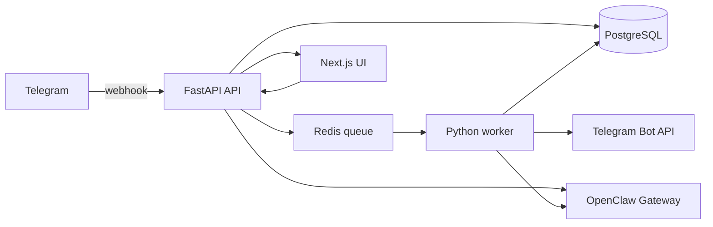

# Agent Orchestration Platform

Monorepo scaffold for an AI agent orchestration platform.

## Stack

- Frontend: Next.js, TypeScript, shadcn/ui, pnpm
- Backend: FastAPI, Python, uv
- Worker: Python, uv
- Persistence: PostgreSQL
- Queue/cache: Redis
- Agent runtime: OpenClaw Gateway
- External channel: Telegram owned by the app, with OpenClaw kept as the internal agent runtime
- Built-in tools: current time, message history lookup/search, Firecrawl web search

## Architecture



## Local Setup

1. Boot the system:

```bash
docker compose up
```

2. Optional: copy env defaults when you need credentials or local overrides:

```bash
cp .env.example .env
```

3. Fill credentials in `.env` as needed, then restart Compose:

```bash
docker compose up
```

Services:

- Web: http://localhost:3000
- API: http://localhost:8000
- API health: http://localhost:8000/health
- API readiness: http://localhost:8000/ready
- OpenClaw Control UI: http://localhost:18789
- PostgreSQL: localhost:5432
- Redis: localhost:6379

## Database

The API container runs migrations before starting Uvicorn. To run migrations manually:

```bash
docker compose exec api uv run python -m app.migrations
```

Readiness checks include actual Postgres, Redis, and OpenClaw connectivity:

```bash
curl http://localhost:8000/ready
```

## Runtime Decision

OpenClaw is the internal runtime dependency for the stack. It owns live agent execution, sessions, memory files, and multi-agent routing. The custom app owns the visual UI, app database, workflow/template configuration, monitoring, Telegram delivery, and the bridge that syncs app-defined agents into OpenClaw-compatible config.

OpenClaw is a better fit than LangGraph here because Telegram and always-on gateway behavior are central requirements. LangGraph is stronger for graph-native workflow modeling, so the app keeps a visual workflow model and maps it into OpenClaw orchestrator/delegate agent configuration.

The active runtime provider is selected with `AGENT_RUNTIME_PROVIDER`, which currently defaults to `openclaw`.

## OpenClaw Agent Sync

The app database is the source of truth for agent configuration. To sync an app agent into the active runtime provider:

```bash
curl -X POST http://localhost:8000/agents/<agent-id>/sync-runtime
```

The sync writes a generated OpenClaw workspace under `.openclaw/workspace/app-agents/<agent-id>/` and upserts the isolated agent entry in `.openclaw/config/openclaw.json`.

## Built-in Tools

Agents can be assigned developer-provided tools from the UI. The current catalog includes:

- `current_time`
- `recent_messages`
- `search_messages`
- `web_search` powered by Firecrawl

The worker executes these tools through the OpenAI function-calling loop when `WORKFLOW_EXECUTION_MODE=openai` is enabled. Tool calls and outputs are stored in run output and shown in the workflow run detail panel.

## Runtime Event Mirroring

OpenClaw or Telegram events can be mirrored into the app message history without re-enqueueing delivery:

```bash
curl -X POST http://localhost:8000/messages/runtime-events \
  -H "Content-Type: application/json" \
  -d '{
    "source": "openclaw",
    "event_type": "telegram.message.received",
    "channel": "telegram",
    "direction": "inbound",
    "body": "hello from telegram",
    "external_id": "telegram:message:demo-1",
    "metadata": {"chat_id": "demo"}
  }'
```

Open the Messages tab in the web UI to confirm the mirrored event is visible.

## Workflow Execution Modes

Workflow runs are executed by the worker. By default, nodes use deterministic mock execution so the stack works without paid model calls:

```bash
WORKFLOW_EXECUTION_MODE=mock
```

To execute agent nodes with OpenAI, set:

```bash
OPENAI_API_KEY=your-openai-key
WORKFLOW_EXECUTION_MODE=openai
WORKFLOW_DEFAULT_MODEL=gpt-4o-mini
```

Then restart the worker:

```bash
docker compose up -d --build worker
```

When `WORKFLOW_EXECUTION_MODE=openai`, agent nodes resolve an app agent by `agent_id`, `agentId`, node label, or node id. If that agent has been synced to OpenClaw, the run output records the `openclaw_agent_id` alongside the OpenAI response metadata. Condition nodes still execute locally.

The worker also records token usage and estimated cost rows per node run. The workflow UI shows prompt tokens, completion tokens, total cost, and any tool calls executed by the node.

## Telegram Setup

Telegram integration is owned by the app:

- The app API accepts Telegram webhooks at `POST /telegram/webhook`, mirrors inbound messages into PostgreSQL, and can start a configured workflow.
- The worker sends queued outbound Telegram messages through Telegram Bot API when `TELEGRAM_BOT_TOKEN` is configured.
- OpenClaw is kept as an internal orchestration/runtime dependency; it should not consume the same Telegram bot token directly.

OpenClaw can still be configured as the runtime gateway for richer live agent sessions.

1. Open Telegram and message `@BotFather`.
2. Run `/newbot`.
3. Choose a display name and bot username.
4. Copy the bot token into `.env`:

```bash
TELEGRAM_BOT_TOKEN=your-token-here
```

5. Optional but recommended: restrict delivery to one chat after you know the chat ID:

```bash
TELEGRAM_ALLOWED_CHAT_ID=your-chat-id
```

6. Optional: protect webhook calls with a secret header:

```bash
TELEGRAM_WEBHOOK_SECRET=local-webhook-secret
```

7. Optional: route inbound Telegram messages into a workflow by setting the default workflow id:

```bash
TELEGRAM_WORKFLOW_ID=workflow-uuid-from-the-ui-or-api
```

When this is set, inbound Telegram messages create a workflow run with a `telegram` trigger. After the run completes, the worker queues a Telegram reply to the same chat.

You can also map commands directly on each workflow in the UI:

- `/research` -> `Research Brief`
- `/support` -> `Support Triage`
- Any plain message with no leading command falls back to `TELEGRAM_WORKFLOW_ID`

8. Restart the stack:

```bash
docker compose up -d --build
```

9. For local webhook testing, use a public HTTPS tunnel such as ngrok:

```bash
ngrok http 8000
curl "https://api.telegram.org/bot$TELEGRAM_BOT_TOKEN/setWebhook" \
  -d "url=https://<your-ngrok-host>/telegram/webhook" \
  -d "secret_token=$TELEGRAM_WEBHOOK_SECRET"
```

10. For outbound testing through the app:

```bash
curl -X POST http://localhost:8000/telegram/messages \
  -H "Content-Type: application/json" \
  -d '{
    "chat_id": "your-chat-id",
    "body": "hello from the agent platform"
  }'
```

11. To mirror a webhook payload locally without Telegram:

```bash
curl -X POST http://localhost:8000/telegram/webhook \
  -H "Content-Type: application/json" \
  -H "X-Telegram-Bot-Api-Secret-Token: local-webhook-secret" \
  -d '{
    "update_id": 1,
    "message": {
      "message_id": 10,
      "chat": {"id": "your-chat-id"},
      "from": {"id": 123},
      "text": "hello from telegram"
    }
  }'
```

12. Add a separate channel to OpenClaw after the gateway is running only if you want OpenClaw-managed Telegram sessions. Prefer a separate bot token so OpenClaw does not consume updates for the app-owned bot:

```bash
docker compose run --rm openclaw-cli channels add --channel telegram --token "$TELEGRAM_BOT_TOKEN"
```

If you use the built-in `web_search` tool, set:

```bash
FIRECRAWL_API_KEY=your-firecrawl-key
```

For local demos, app webhooks require a publicly reachable HTTPS URL. If you only want to verify persistence without a tunnel, use the local webhook curl above and confirm the message appears in the Messages tab.

## Monorepo Layout

```text
apps/
  api/      FastAPI service
  web/      Next.js application
  worker/   background worker process
```

Current implementation includes Docker boot wiring, OpenClaw gateway wiring, PostgreSQL migrations, agent CRUD/config API, a shadcn-based agent management UI, workflow templates/runs, a Redis-backed message delivery queue, token usage tracking, developer-defined built-in tools, and Telegram webhook/outbound delivery scaffolding.
The workflow builder can save visual graph JSON, preview nodes/edges, instantiate the built-in Research Brief and Support Triage templates, preserve OpenClaw orchestrator/delegate mapping metadata, start deterministic or OpenAI-backed workflow runs, and display per-node run state, tool calls, and cost rows. Workflow run state is polled automatically in the UI while the detail panel stays open.
